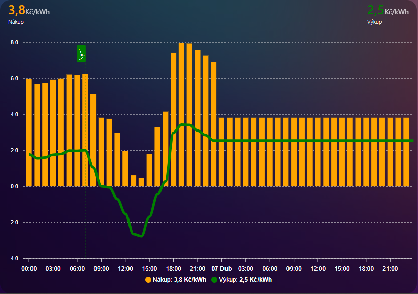

# Spotové ceny pro Home Assistant

Tato integrace umožňuje sledovat spotové ceny elektřiny v kombinaci s HDO tarifem.

## Instalace

### HACS (doporučeno)
1. Zajistěte, že máte nainstalovaný [HACS](https://hacs.xyz/)
2. Přejděte do HACS > Integrace > Nabídka (tři tečky v pravém horním rohu) > Vlastní repozitáře
3. Přidejte URL tohoto repozitáře
4. Klikněte na "Stáhnout"
5. Restartujte Home Assistant

### Ruční instalace
1. Stáhněte si nejnovější verzi z GitHubu
2. Rozbalte soubor a zkopírujte složku `custom_components/spot_electricity_price` do složky `custom_components` ve vaší instalaci Home Assistant
3. Restartujte Home Assistant

## Další potřebné integrace
aktuálně je ještě potřeba přidat 2 integrace


Základní spotová cena - https://github.com/rnovacek/homeassistant_cz_energy_spot_prices

Vyčítání HDO stavu z portálu: 
- EG.D - https://github.com/Antrac1t/HomeAssistant-EGDdistribuce
- PRE  - https://github.com/slesinger/HomeAssistant-PREdistribuce
- ČEZ  - https://github.com/zigul/HomeAssistant-CEZdistribuce - prozatím nefunkční

Má konfigurace configuration.yaml pro EG.D HDO
```
binary_sensor:
  - platform: egddistribuce
    name: HDO_nizky_tarif
    psc: "smart"
    code_a: "Cd2526_3"   # kod smart elektromeru
    price_vt: "2.12308"  # s DPH
    price_nt: "0.22264"  # s DPH
```

## Konfigurace

Po instalaci přidejte integraci přes Nastavení > Zařízení a služby > Integrace > Přidat integraci > Spotové ceny

### Požadované parametry:
- Název: Název integrace (výchozí: Spotové ceny)
- Distributor: Váš distributor elektřiny (EG.D, ČEZ, PRE) - pro budoucí implementaci v rámci jedné integrace
- Kód elektroměru: Kód elektroměru pro HDO - pro budoucí implementaci v rámci jedné integrace
- Cena VT: Cena ve vysokém tarifu (včetně DPH)
- Cena NT: Cena v nízkém tarifu (včetně DPH)
- Entita spotové ceny: Entita poskytující spotové ceny (bez DPH)
- HDO entita: Entita poskytující informace o HDO (bez DPH)
- Další parametry pro výpočet ceny elektřiny (bez DPH)
  
### Základní nastavení pro DeltaGreen tarif D25d na území EG.D v dubnu 2025 je:
```
- Název: Název integrace (výchozí: Spotové ceny)
- Distributor: Váš distributor elektřiny (EG.D, ČEZ, PRE) - EG.D - pro budoucí implementaci v rámci jedné integrace
- Kód elektroměru: Kód elektroměru pro HDO - Cd2526_3 - pro budoucí implementaci v rámci jedné integrace
- Cena VT: Cena ve vysokém tarifu (včetně DPH) - 2,12308
- Cena NT: Cena v nízkém tarifu (včetně DPH) - 0,22264
- Entita spotové ceny: Entita poskytující spotové ceny (bez DPH) - sensor.current_spot_electricity_price
- HDO entita: Entita poskytující informace o HDO (bez DPH) - binary_sensor.hdo_nizky_tarif
- Další parametry pro výpočet ceny elektřiny (bez DPH)
  - Prodej (služby obchodu) - 0,35
  - Daň z elektřiny - 0,0283
  - Cena systémových služeb - 0,17092
  - OZE - 0,495
  - Výkup - -0,45
```
## Přidání grafu do lovelace 

```
type: custom:apexcharts-card
header:
  show: true
  show_states: true
  colorize_states: true
graph_span: 2d
stacked: false
span:
  start: day
  offset: +0d
now:
  show: true
  label: Nyní
  color: green
series:
  - entity: sensor.soucet
    name: Nákup
    color: orange
    type: column
    group_by:
      func: max
      duration: 1hour
    unit: Kč/kWh
    data_generator: >
      return  Object.entries(entity.attributes.Celkem).map(([date, value],
      index) => {
        return [new Date(date).getTime(), value];
      });
  - entity: sensor.vykup
    name: Výkup
    color: green
    type: line
    group_by:
      func: max
      duration: 1hour
    unit: Kč/kWh
    data_generator: >
      return  Object.entries(entity.attributes.Vykup_data).map(([date, value],
      index) => {
        return [new Date(date).getTime(), value];
      });

```

